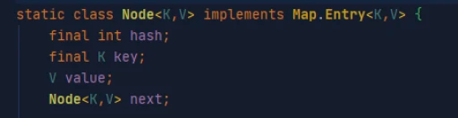

Пожалуй, один из самых популярных вопросов при собеседовании Java-разработчика.

HashMapv работает с парами ключ – значение. Как же они хранятся внутри самого HashMapv?

Внутри HashMap есть массив нод:

Node<K,V>[] table

По умолчанию размер массива — 16, и он увеличивается каждый раз в два раза по мере заполнения элементами (при достижении
LOAD_FACTOR — определенного процента заполненности, по умолчанию он — 0.75).

Каждая из нод хранит в себе хеш ключа, ключ, значение, ссылку на следующий элемент:

Собственно, “ссылка на следующий элемент” означает, что мы имеем дело с односвязным списком, где каждый элемент содержит
ссылку на следующий.

То есть HashMap хранит данные в массиве односвязных списков.

Но сразу отмечу: когда одна ячейка массива table имеет ссылку на подобный односвязный список, состоящий из более чем
одного элемента, это не есть хорошо. Такое явление называется коллизия.

Но обо всём по порядку. Давайте разберемся, как происходит сохранение новой пары через метод put.

Сперва берется hachCode() ключа. Поэтому для корректной работы hashmap в качестве ключей нужно брать классы, в которых
данный метод переопределен.

Далее этот хеш код используется во внутреннем методе — hash() — для определения числа в пределах размера массива table.

Далее по полученному числу, идёт обращение к конкретной ячейке массива table.

Тут у нас два случая:
Ячейка пустая — в нее сохраняется новое значение Node. Ячейка не пустая — сравнивается значение ключей. Если они равны,
новое значение Node перезаписывает старое, если не равны — идёт обращение к элементу next (следующему), идёт сравнение
уже с его ключом… И так до тех пор, пока новое значение не перезапишет некоторое старое или не достигнет конца
односвязного списка и сохранится там последним элементом. При поиске элемента по ключу (метод get(<key>)), вычисляется
hashCode ключа, потом его значение в пределах массива с помощью hash(), и по полученному числу находится ячейка массива
table, в которой уже ведется поиск путем перебора нод и сравнения ключа искомой ноды с ключом текущей.

Операции в Map при идеальном раскладе имеют алгоритмическую сложность O(1), ведь идёт обращение к массиву, а как вы
помните, независимо от количества элементов операции у массива имеют сложность O(1).

Но это в идеальном случае.

Когда используемая ячейка массива не пустая (2) и там уже есть некоторые ноды, алгоритмическая сложность превращается в
линейную O(N), ведь теперь необходимо перебрать элементы, прежде чем найдется нужное место.

Не могу не упомянуть вот что: начиная с Java 8, если у односвязного списка node больше 8 элементов (коллизии), он
превращается в двоичное дерево. В таком случае алгоритмическая сложность будет уже не O(N), а O(log(N)) — это уже другое
дело, не так ли?

https://javarush.com/groups/posts/2496-podrobnihy-razbor-klassa-hashmap