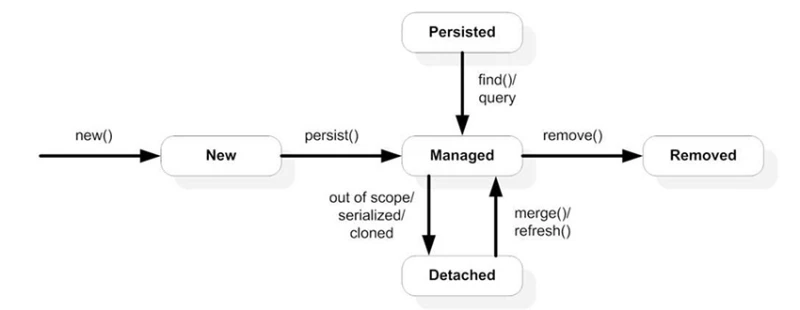

В первую очередь хотелось бы отметить, что EntityManager — один из ключевых компонентов JPA, который используется для взаимодействия сущностей с базой данных.

В общем-то методы взаимодействия сущности с БД у него-то и вызываются (persist, merge, remove, detach)... Но также отмечу, что данный компонент как правило не является одним на всё приложение: чаще всего он легковесен, часто удаляется и создается новый с помощью EntityManagerFactory.

Если проводить параллель с JDBC, где EntityManagerFactory будет являться аналогом DataSource, то EntityManager в свою очередь будет являться аналогом Connection.

Ранее я упоминал про персистентную (persistence) сущность, как сущность, которая управляется текущим соединением.

Так вот: эта сущность управляется именно EntityManager-ом, который тесно связан с текущим соединением и TransactionManager-ом, который отвечает за открытие/закрытие транзакций.

Далее на рисунке ниже вы можете видеть жизненный цикл сущности:Разбор вопросов и ответов с собеседований на Java-разработчика. Часть 6 - 5EntityManager управляет сущностью, когда она на этапе Managed (в это время она персистентная, т.к. имеет связь с EntityManager-ом). То есть, она уже не new и ещё не removed. Можно сказать, что когда сущность new или removed, она также и detached, т.к. она не управляется EntityManager-ом.

Существуют разные стратегии для EntityManager-а. То есть, может быть один синглтоновый EntityManager на всё приложение, а может создаваться каждый раз новый, под каждое соединение. Если же вы используете Spring, то управление созданием/удалением EntityManager-а происходит автоматически под капотом (но это не значит, что нельзя настроить это под себя ^^).

Стоит сказать, что один или несколько EntityManager-ов и образуют и persistence context.

Persistence context — это среда в которой экземпляры сущностей синхронизируются с аналогичными сущностями в базе данных (как я и говорил, это работает только для персистентных сущностей).

Если вы углубитесь в изучение JPA (что я очень вам рекомендую), то с данными понятием вы будете сталкиваться очень и очень часто.