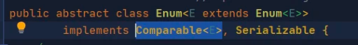
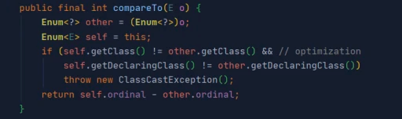
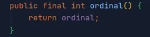

Как было сказано ранее, ordinal() возвращает порядковый номер значения в общем списке перечислений.

Также в разборе предыдущего вопроса вы увидели, что элементы перечислений, попав, например, в TreeSet (отсортированное множество) принимают порядок, в котором они объявлены в enum. И как мы знаем, TreeSet и TreeMap сортируют элементы посредством вызова у них метода compareTo() интерфейса Comparable.

Из этого можно сделать предположение, что класс Enum имплементирует интерфейс Comparable, реализуя его в метод compareTo(), внутри которого и используется ordinal() для задания порядка сортировки.

Зайдя в класс Enum, мы видим подтверждение этого:

И тело самого метода:

Метод ordinal() тут не вызывается. Вместо этого используется переменная ordinal — порядковый номер элемента в перечислении.

Сам же метод ordinal() —

— не более чем геттер для переменной ordinal.