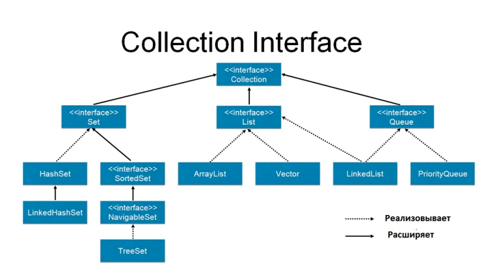
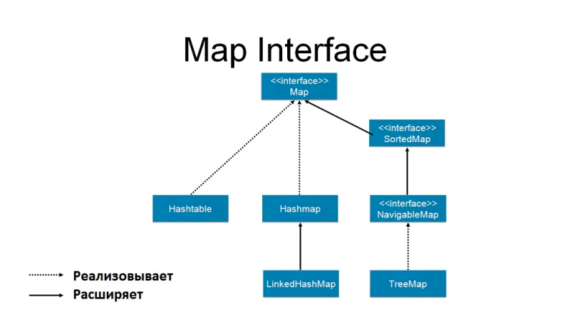

Иерархия коллекций в Java Collection Framework выглядит следующим образом:

Collection - базовый интерфейс, который определяет общие методы для всех типов коллекций. Он в свою очередь наследуется от интерфейса Iterable, который определяет метод для перебора элементов коллекции.

List - интерфейс, который представляет упорядоченный список элементов. Он наследуется от интерфейса Collection и имеет методы для работы с элементами по индексу.

ArrayList - класс, который представляет список на основе массива.
LinkedList - класс, который представляет список на основе связанного списка.
Set - интерфейс, который представляет набор уникальных элементов. Он наследуется от интерфейса Collection и не допускает наличия дублирующихся элементов.

HashSet - класс, который представляет множество на основе хэш-таблицы.
TreeSet - класс, который представляет множество в виде дерева.
Queue - интерфейс, который представляет очередь элементов. Он наследуется от интерфейса Collection и имеет методы для добавления и удаления элементов в начале и конце очереди.

PriorityQueue - класс, который представляет очередь с приоритетом.
Deque - интерфейс, который представляет двустороннюю очередь элементов. Он наследуется от интерфейса Queue и имеет методы для добавления и удаления элементов в начале и конце очереди.

ArrayDeque - класс, который представляет двустороннюю очередь на основе массива.
Кроме того, в Java Collection Framework есть еще несколько интерфейсов и классов, которые не входят в эту иерархию, но также представляют коллекции или элементы коллекций.

