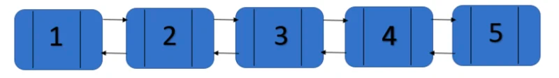
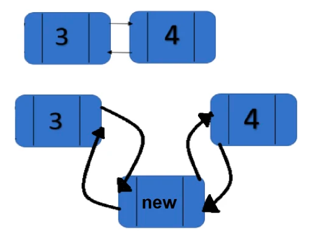
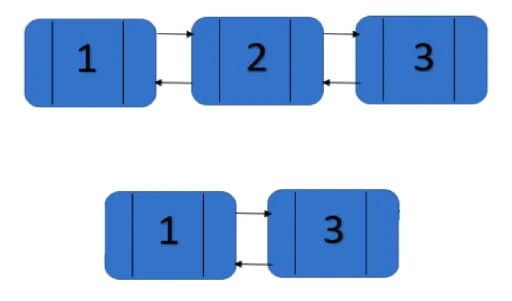

Если ArrayList содержит элементы во внутреннем массиве, то LinkedList — в виде двусвязного списка.

Это значит, что каждый элемент содержит ссылку на предыдущий элемент (previous) и на следующий (next).

У первого элемента нет ссылки на предыдущий (он ведь первый), при этом он считается главой списка, и в LinkedList есть
ссылка непосредственно на него.

У последнего элемента, собственно, нет следующего элемента, он является хвостом списка, и поэтому прямая ссылка на него
есть в самом LinkedList. Поэтому логарифмическая сложность при доступе к главе или хвосту списка — O(1). 

В ArrayList при
увеличении списка увеличивался внутренний массив, тут же все происходит проще — при добавлении элемента просто меняются
пару ссылок.

Давайте рассмотрим некоторые наиболее используемые методы LinkedlList-а:

1. add(<Elelement>) — происходит добавление в конце списка, т.е. после последнего элемента (5) добавится ссылка на новый
   элемент как next. Новому элементу добавится ссылка на последний (5) как previous элемент.

Логарифмическая сложность такой операции будет O(1), так как необходима всего лишь ссылка на последний элемент, а как вы
помните, на хвост есть прямая ссылка с LinkedList и логарифмическая сложность доступа к нему минимальная.

2. add(<Index>,<Elelement>) — добавление элемента по индексу.

При добавлении элемента, например, в середину списка, сперва перебираются элементы с головы и хвоста (с обеих сторон),
пока не будет найдено нужное место. Если мы хотим вставить элемент между третьим и четвертым (на рисунке выше), то при
поиске нужного места ссылка next третьего элемента будет уже указывать на новый. У нового же ссылка previous будет
указывать на третий. Соответственно, ссылка четвертого элемента — previous — будет указывать уже на новый элемент, а у
нового элемента ссылка next будет указывать на четвертый элемент:

Логарифмическая сложность данного метода будет зависеть от индекса, задаваемого новому элементу:
если он будет близок к голове или хвосту, то будет приближаться к O(1), поскольку перебирать элементы фактически будет
не нужно; если же близко к середине, то O(N/2) — будет происходить переборка элементов с головы и хвоста одновременно,
пока не будет найден нужный элемент.

3. set(<Index>,<Elelement>) — записывает элемент в указанную позицию в списке. Логарифмическая сложность данной операции
   будет колебаться от O(1) до O(N/2), опять же в зависимости от того, насколько близок элемент к голове, хвосту или
   середине.

4. remove(<index>) — удаляет элемент из списка, по сути делая так, чтобы элемент, который находится перед удаляемым (
   previous), ссылался на элемент, который идёт после удаляемого (next). И наоборот: чтобы элемент, который идет после
   удаляемого, ссылался на тот, который идёт перед удаляемым:
   Получился процесс, обратный добавлению по индексу (add(<Index>,<Elelement>)).

Желающим узнать больше о внутреннем устройстве LinkedList посоветую прочесть вот эту статью.
