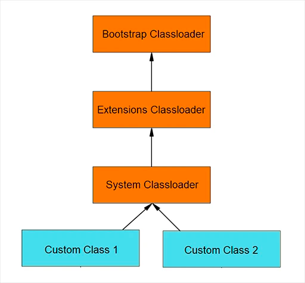

Classloader — или Загрузчик классов — обеспечивает загрузку классов Java.

А точнее, обеспечивают загрузку его наследники — конкретные загрузчики классов, т.к. сам ClassLoader абстрактен.

Каждый раз, когда загружается какой-либо .class-файл, например, после обращения к конструктору или статическому методу
соответствующего класса, это действие выполняет один из наследников класса ClassLoader.

Есть три вида наследников:
Bootstrap ClassLoader — базовый загрузчик, реализован на уровне JVM и не имеет обратной связи со средой выполнения, так
как является частью ядра JVM и написан в машинном коде. Данный загрузчик служит родительским элементом для всех других
экземпляров ClassLoader.

В основном отвечает за загрузку внутренних классов JDK, обычно rt.jar и других основных библиотек, расположенных в
каталоге $ JAVA_HOME / jre / lib. У разных платформ могут быть разные реализации этого загрузчика классов. Extension
Classloader — загрузчик расширений, потомок класса базового загрузчика. Заботится о загрузке расширения стандартных
базовых классов Java. Загружается из каталога расширений JDK, обычно — $ JAVA_HOME / lib / ext или любого другого
каталога, упомянутого в системном свойстве java.ext.dirs (с помощью данной опции можно управлять загрузкой расширений).

System ClassLoader — системный загрузчик, реализованный на уровне JRE, который заботится о загрузке всех классов уровня
приложения в JVM. Он загружает файлы, найденные в переменном окружении классов -classpath или -cp опции командной
строки.

загрузчики классов — это часть среды
выполнения Java.

В тот момент когда JVM запрашивает класс, загрузчик классов пытается найти класс и загрузить определение класса в среду
выполнения, используя полное имя класса.

Метод java.lang.ClassLoader.loadClass() отвечает за загрузку определения класса во время выполнения.

Он пытается загрузить класс на основе полного имени. Если класс еще не загружен, он делегирует запрос загрузчику
родительского класса.

Этот процесс происходит рекурсивно выглядит так:
System Classloader пытается найти класс в своем кеше.

1.1. Если класс найден, загрузка успешно завершена.

1.2. Если класс не найден, загрузка делегируется к Extension Classloader-у.

Extension Classloader пытается найти класс в собственном кеше.

2.1. Если класс найден — успешно завершена.

2.2. Если класс не найден, загрузка делегируется Bootstrap Classloader-у.

Bootstrap Classloader пытается найти класс в собственном кеше.

3.1. Если класс найден, загрузка успешно завершена.

3.2. Если класс не найден, базовый Bootstrap Classloader попытается его загрузить.

Если загрузка:

4.1. Прошла успешно — загрузка класса завершена.

4.2. Не прошла успешно — управление передается к Extension Classloader.

5. Extension Classloader пытается загрузить класс, и если загрузка:

5.1. Прошла успешно — загрузка класса завершена.

5.2. Не прошла успешно — управление передается к System Classloader.

6. System Classloader пытается загрузить класс, и если загрузка:

6.1. Прошла успешно — загрузка класса завершена.

6.2. Не прошла успешно — генерируется исключение — ClassNotFoundException.