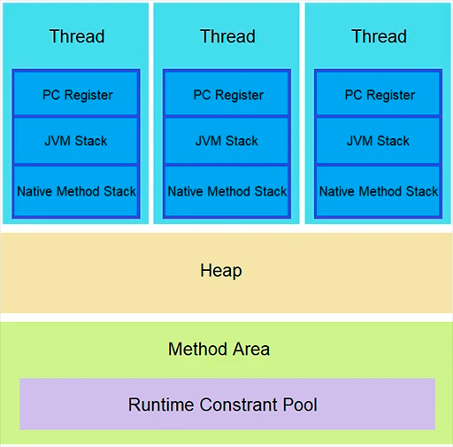

Run-Time Data Ares — области данных среды выполнения JVM.

JVM определяет некоторые области данных времени выполнения, необходимые во время выполнения программы. Одни из них
создаются при запуске JVM. Другие являются локальными по отношению к потокам и создаются только при создании потока (и
уничтожаются, когда поток уничтожается).

Области данных среды выполнения JVM выглядят так:

PC Register — регистр ПК — локален для каждого потока и содержит адрес инструкции JVM, которую поток выполняет в данный
момент.

JVM Stack — область памяти, которая используется как хранилище для локальных переменных и временных результатов. У
каждого потока есть свой отдельный стек: как только поток завершается, этот стек также уничтожается. Стоит отметить, что
преимуществом stack над heap является производительность, в то время как heap безусловно имеет преимущество в масштабе
хранилища.

Native Method Stack — область данных для каждого потока, в которой хранятся элементы данных, аналогичные стеку JVM, для
выполнения собственных (не Java) методов.

Heap — используется всеми потоками как хранилище которое содержит объекты, метаданные классов, массивы и т. д., которые
создаются во время выполнения. Данная область создается при запуске JVM и уничтожается при завершении ее работы.

Method area — область метода — эта область времени выполнения общая для всех потоков и создается при запуске JVM. Он
хранит структуры для каждого класса, такие как пул констант (Runtime Constant Pool — пул для хранения констант), код для
конструкторов и методов, данные метода и т. д.

