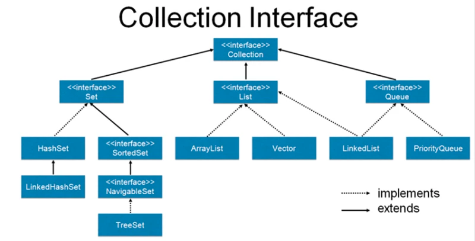

Collection — интерфейс, который является головой в иерархии коллекций. Он представляет классы, позволяющие создавать, содержать и изменять целые группы объектов. Для этого предоставляется множество методов, вроде add(), remove(), contains() и других.

Основные интерфейсы класса Collection:
Set — интерфейс, описывающий множество, которое содержит неупорядоченные уникальные (неповторяющиеся) элементы.

List — интерфейс, описывающий структуру данных, которая хранит упорядоченную последовательность объектов. Эти объекты получают свой индекс (номер), используя который можно взаимодействовать с ними: брать, удалять, изменять, перезаписывать.

Queue — интерфейс, описывающий структуру данных с хранением элементов в виде очереди, которая следует правилу — FIFO — First In First Out.

Подробнее о [Collection.](https://javarush.com/groups/posts/2308-korotko-o-glavnom---java-collections-framework)

Collections — утилитный класс, предоставляющий множество всевозможных служебных методов.

Например:
addAll(Collection<? super T> collection, T…element) — добавляет в collection переданные элементы типа Т.

сopy(List<? super T> dest, List<? extends T> src) — копирует все элементы из списка src в список в dest.

emptyList() — возвращает пустой список.

max(Collection<? extends T> collection, Comparator<? super T> comp) — возвращает максимальный элемент данной коллекции в соответствии с порядком, установленным указанным компаратором.

unmodifiableList(List<? extends T> list) — возвращает неизменяемое представление переданного списка.

И таких разнообразных удобных методов в Collections — великое множество.

С полным списком данных методов можно ознакомиться [на сайте Oracle.](https://docs.oracle.com/en/java/javase/11/docs/api/java.base/java/util/Collections.html)

Я не зря сказал, что они удобные. Ведь они все статические. То есть, вам не нужно каждый раз создавать объект данного класса, чтобы вызвать у него необходимый метод.

Вам достаточно лишь прописать название класса, вызвать у него нужный метод и передать все требуемые аргументы.

Подводя черту, Collection — корневой интерфейс структуры коллекций. Collections —  вспомогательный класс для более удобной обработки объектов, принадлежащих типу из структуры коллекций.
